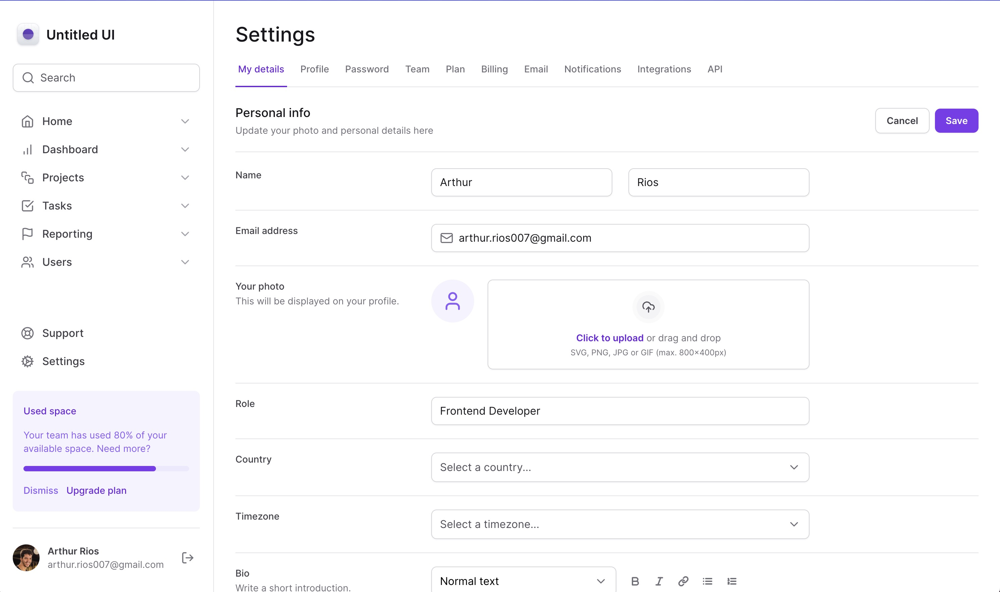
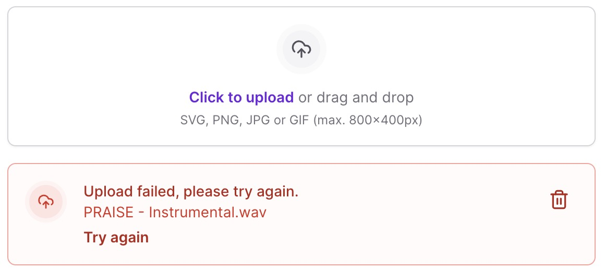
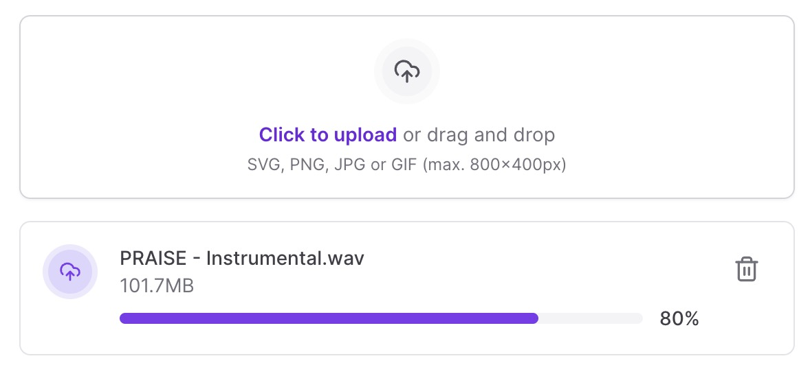
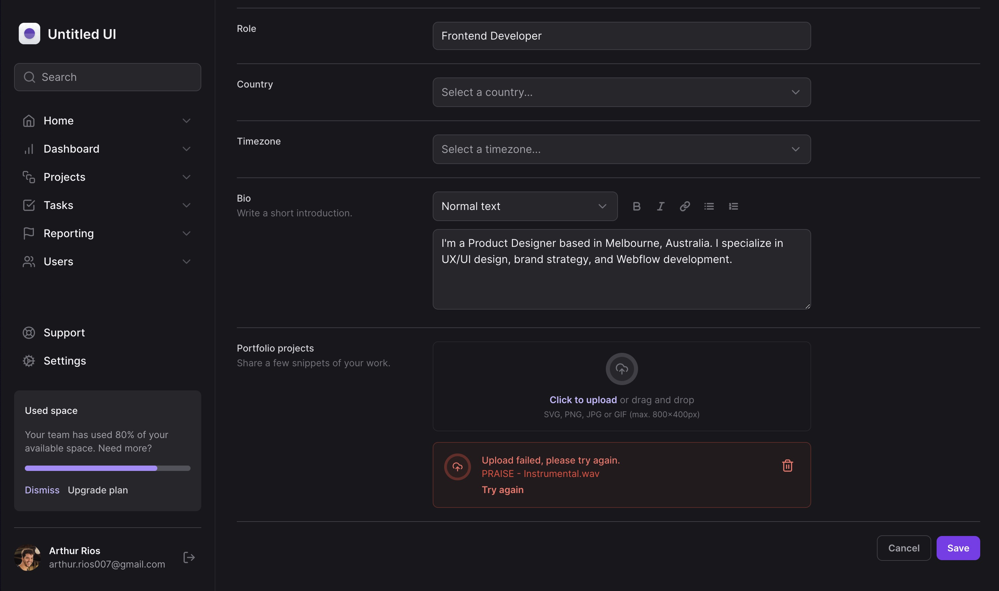
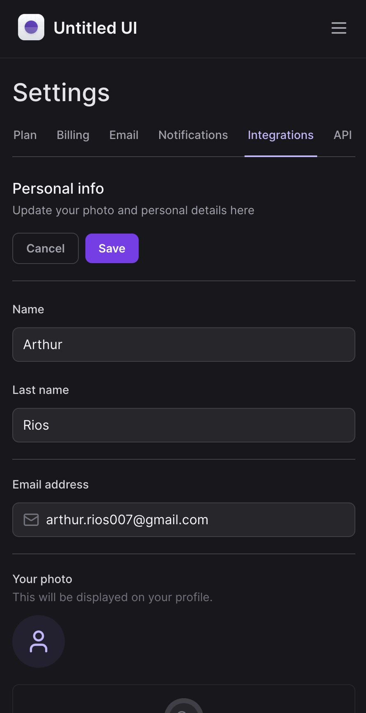

# Tailwind Form Template
## The App
This is a form interface created using Tailwind CSS. Developed at Rocketseat Academy with the most recent technologies from PostCSS Frameworks and CSS Libraries.

### Previews
#### Main Page
<h1 align="center">
  
</h1>

#### States

<h1 align="center">
  
</h1>
<h1 align="center">
  
</h1>

#### Dark Mode
<h1 align="center">
  
</h1>

#### Responsive Design
<h1 align="center" style="height: 40rem">
  
</h1>

### Techs
1. Next.js
2. Tailwind CSS
3. Radix.ui
4. Framer Motion

### Steps
1. Clone this repository;
2. Run your preferred command to install dependencies:
- `npm install`
- `yarn install` or `yarn`
3. Run the app with:
- `npm run dev`
- `yarn run dev` or `yarn dev`
